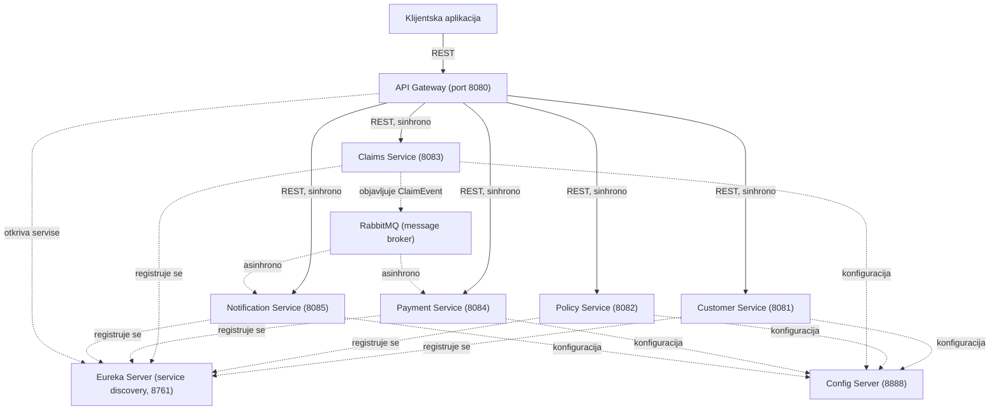

# Mikroservisni sistem za upravljanje osiguranjem

Mikroservisni sistem za upravljanje osiguranjem, razvijen u okviru predmeta **Distribuirani informacioni sistemi**.

Sistem digitalizuje osnovni poslovni proces osiguravajuće kuće: registraciju klijenta, izdavanje polise, prijavu štete od strane klijenta, obradu i odlučivanje o šteti, i konačno isplatu i obaveštavanje klijenta o ishodu. Svaki od ovih poslovnih koraka je izdvojen u samostalan mikroservis.

## Sadržaj

- [Opis poslovne logike](#opis-poslovne-logike)
- [Arhitektura sistema](#arhitektura-sistema)
- [Tehnologije](#tehnologije)
- [Struktura projekta](#struktura-projekta)
- [Uputstvo za pipeline (build/test/deploy)](#uputstvo-za-pipeline-buildtestdeploy)
- [Testiranje](#testiranje)

---

## Opis poslovne logike

Poslovna logika sistema podeljena je na **5 mikroservisa**, od kojih svaki odgovara jednoj celini poslovnog procesa osiguranja. Uz njih, sistem se oslanja na tri infrastrukturne komponente (service discovery, centralizovana konfiguracija, API gateway) koje omogućavaju da ovih 5 servisa funkcioniše kao jedinstven sistem, a ne kao skup nezavisnih aplikacija.

### Customer Service (port 8081)

Vodi matičnu evidenciju klijenata osiguravajuće kuće — lične podatke potrebne za identifikaciju i kontakt. Ovo je nezavisan izvor istine o klijentu: polise i štete ga kasnije samo *referenciraju* (preko `customerId`).

- **Entitet:** `Customer` — ime, prezime, email, telefon, adresa, datum rođenja, JMBG
- **Endpoints:** `POST /customers`, `GET /customers`, `GET /customers/{id}`, `PUT /customers/{id}`, `DELETE /customers/{id}`
- **Komunikacija:** isključivo sinhrona (REST) — upis i čitanje podataka o klijentu su operacije koje zahtevaju trenutan odgovor

### Policy Service (port 8082)

Vodi evidenciju izdatih polisa osiguranja — ugovora između klijenta i osiguravajuće kuće. Prati osnovne poslovne podatke o polisi: period važenja, iznos premije i trenutni status (aktivna, istekla, otkazana).

- **Entitet:** `Policy` — broj polise, referenca na klijenta, tip osiguranja, datum početka i isteka, iznos premije, status
- **Endpoints:** `POST /policies`, `GET /policies`, `GET /policies/{id}`, `PUT /policies/{id}`, `DELETE /policies/{id}`
- **Komunikacija:** sinhrona (REST)

### Claims Service (port 8083)

Vodi obradu prijava šteta — od trenutka kada klijent prijavi štetu, preko internog razmatranja, do konačne odluke.

Ovaj servis je okidač za ostatak poslovnog procesa: kada operater donese odluku o šteti, ta odluka mora da pokrene dalje korake (isplatu i obaveštenje klijenta) u druga dva servisa, bez direktne zavisnosti Claims servisa od njih.

- **Entitet:** `Claim` — referenca na polisu i klijenta, datum incidenta, datum prijave, opis štete, prijavljen iznos, status
- **Endpoints:** `POST /claims`, `GET /claims`, `GET /claims/{id}`, `GET /claims?policyId=`, `GET /claims?customerId=`, `PUT /claims/{id}/status`, `DELETE /claims/{id}`
- **Komunikacija:**
  - sinhrona (REST) za prijavu štete i pregled postojećih prijava
  - **asinhrona** — kada operater promeni status štete u `APPROVED` ili `REJECTED`, servis objavljuje događaj (`ClaimEvent`) na message broker, umesto da direktno poziva Payment i Notification servise

### Payment Service (port 8084)

Vodi evidenciju finansijskih transakcija vezanih za polisu: naplatu premije koju klijent plaća, i isplatu štete koju osiguravajuća kuća duguje klijentu nakon odobrene prijave.

Ova dva tipa transakcije se razlikuju po poreklu: naplata premije je direktna, ručna radnja, dok je isplata štete posledica odluke iz Claims servisa i dešava se automatski.

- **Entitet:** `Payment` — referenca na štetu (samo za isplate), polisu, klijenta, tip transakcije (`PREMIUM` ili `PAYOUT`), iznos, status (`PENDING`/`COMPLETED`/`FAILED`), datum
- **Endpoints:** `POST /payments`, `GET /payments`, `GET /payments/{id}`, pretraga po `claimId`/`policyId`/`customerId`, `DELETE /payments/{id}`
- **Poslovno pravilo:** transakcija tipa `PAYOUT` mora imati povezanu štetu (`claimId`) — bez toga se ne zna na osnovu čega se isplata vrši, pa servis odbija takav zahtev sa `400 Bad Request`
- **Komunikacija:**
  - sinhrona (REST) za ručnu naplatu premije
  - **asinhrona** — servis sluša `ClaimEvent`; kada stigne odobrena šteta, automatski kreira isplatu sa statusom `PENDING` (čeka dalju finansijsku obradu)

### Notification Service (port 8085)

Obaveštava klijenta o ishodu njegove prijave štete. Za razliku od ostalih servisa, ovaj nema REST endpoint za ručno kreiranje notifikacija — notifikacije nastaju isključivo kao reakcija na odluku o šteti. REST deo servisa postoji samo da se može pogledati istorija poslatih obaveštenja.

- **Entitet:** `Notification` — referenca na klijenta, kanal slanja (EMAIL/SMS), tip obaveštenja, sadržaj poruke, vreme slanja, status
- **Endpoints:** `GET /notifications`, `GET /notifications/{id}`, `GET /notifications?customerId=`
- **Komunikacija:** isključivo **asinhrona** — sluša `ClaimEvent` za oba moguća ishoda (`APPROVED` i `REJECTED`) i za svaki generiše odgovarajuće obaveštenje

---

## Arhitektura sistema



**Baze podataka.** Svaki poslovni servis ima sopstvenu, izolovanu PostgreSQL bazu (database-per-service pristup), pokrenutu kao poseban Docker kontejner: `customerdb`, `policydb`, `claimsdb`, `paymentdb`, `notificationdb`. Servisi ne dele bazu niti direktno pristupaju tuđim tabelama — svaka razmena podataka između njih ide preko REST poziva ili preko događaja na message broker-u.

**Primer poslovnog toka kroz sistem:**

1. Klijent prijavi štetu — sinhron REST poziv ka Claims servisu
2. Operater donese odluku — `PUT /claims/{id}/status` menja status u `APPROVED`
3. Claims servis objavljuje `ClaimEvent` na RabbitMQ, ne čekajući odgovor od drugih servisa
4. Payment servis, nezavisno, prima taj događaj i kreira isplatu statusa `PENDING`
5. Notification servis, takođe nezavisno, prima isti događaj i generiše obaveštenje klijentu


---

## Tehnologije

| Komponenta | Tehnologija |
|---|---|
| Jezik / Framework | Java 17, Spring Boot 3.5.4 |
| Service discovery | Spring Cloud Netflix Eureka |
| Centralizovana konfiguracija | Spring Cloud Config Server |
| API Gateway | Spring Cloud Gateway |
| Asinhrona komunikacija | Spring Cloud Stream + RabbitMQ |
| Perzistencija | Spring Data JPA + PostgreSQL (Docker), H2 (lokalni dev) |
| Build alat | Gradle (multi-modul) |
| Kontejnerizacija | Docker, Docker Compose |
| Testiranje | JUnit 5, Mockito, MockMvc |
| CI/CD | GitHub Actions |

---


Svaki servis je samostalan Spring Boot projekat sa sopstvenim `build.gradle`, povezan u jedinstven build preko root `settings.gradle` fajla.

---

## pipeline (build/test/deploy)

### Lokalni razvoj (dev)

Namenjen razvoju i debagovanju pojedinačnog servisa.

1. Pokrenuti infrastrukturu redom: Eureka server → Config server
2. Pokrenuti poslovne servise, bilo kojim redosledom: Customer, Policy, Claims, Payment, Notification
3. Pokreni Gateway poslednji jer mora da zatekne već registrovane servise na Eureci
4. Testirati preko `http://localhost:8080/<resurs>` (kroz Gateway) ili direktno na portu pojedinačnog servisa

### Build i test

```bash
# Iz root foldera
./gradlew build -x test    # kompajlira sve module
./gradlew test              # pokreće sve testove (unit + integracione)
```

### Kontejnerizovano okruženje

Podiže ceo sistem u kontejnerizovanom obliku, sa PostgreSQL bazama i RabbitMQ brokerom umesto lokalnih zamena.

```bash
# Iz root foldera
docker compose up -d --build
```

Komanda podiže 14 kontejnera: 5 PostgreSQL baza, RabbitMQ, Eureka server, Config server, 5 poslovnih servisa i Gateway. Svaki servis se gradi iz istog `Dockerfile`-a, parametrizovanog preko `SERVICE_NAME` build argumenta.

Provera da je sistem ispravno podignut:

```bash
docker ps                                    # svih 14 kontejnera treba da bude "Up"
curl http://localhost:8761                   # Eureka dashboard
curl http://localhost:8080/customers         # test kroz Gateway
```

Zaustavljanje sistema:

```bash
docker compose down          # zaustavlja kontejnere, podaci u bazama ostaju sačuvani
docker compose down -v       # zaustavlja i briše sve podatke, za potpuno svež start
```

### CI/CD pipeline (GitHub Actions)

Pipeline definisan u `.github/workflows/ci.yml` sastoji se od dva posla:

1. **build-and-test** — kompajlira sve module i pokreće kompletnu test suitu, izveštaji o testovima se objavljuju kao artifact
2. **docker-build** — izvršava se samo ako prvi posao prođe uspešno; gradi Docker sliku za svih 8 servisa

Pipeline se pokreće automatski pri svakom push-u i pull request-u ka `main` i `develop` granama.

---

## Testiranje

Svaki poslovni servis ima:

- **Unit testove** servisnog sloja — Mockito sa mockovanim repository slojem, pokrivaju CRUD operacije, slučajeve kada traženi resurs ne postoji, i poslovnu logiku specifičnu za servis (npr. proveru da `PAYOUT` plaćanje mora imati postavljen `claimId`)
- **Integracione testove** kontroler sloja — `@WebMvcTest`/`@SpringBootTest` uz `MockMvc`, provera kompletnog HTTP request/response ciklusa
- **Testove event konzumenata** (Payment i Notification servis) — provera da reakcija na `ClaimEvent` ispravno kreira odgovarajuće zapise, nezavisno od pravog message broker-a

Pokretanje svih testova iz root foldera:

```bash
./gradlew test
```
